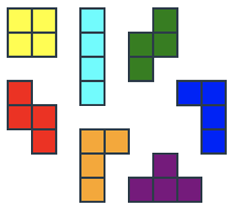

# Doodads

Tetris made with [Elm](http://elm-lang.org/)




This project is bootstrapped with [Create Elm App](https://github.com/halfzebra/create-elm-app).

Install `create-elm-app`
```bash
npm install -g create-elm-app
```

Commands:
- `elm-app start`
- `elm-app test`
- `elm-app build`
- `elm-app eject`
